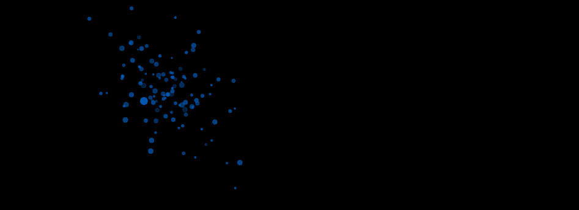
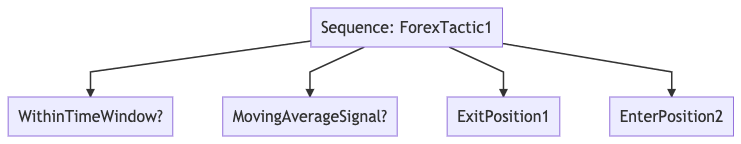

#  ⦿	| Automata | ⦿	⦿ 	⦿	⦿

<!--  -->



 Spawn a [system](http://web.stanford.edu/class/ee380/Abstracts/190123.html) of concurrent, distributed, fault tolerant, and highly available intelligent agents for coordinated and/or uncoordinated action in one or many environments with no central point of failure. This project is Open Source. [](https://opensource.org/licenses/Apache-2.0)

## Project Mission
The Automata Project combines the state-of-the-art AI control techniques with the latest research in autonomous decentralized systems, providing AI designers a flexible framework for creating valuable emergent properties in real world systems.

##### This project is in the Alpha stage and not ready for production systems. We need Contributors to get to 1.0. We are eager for your contributions and very happy you found yourself here! Please join the [slack channel](https://join.slack.com/t/automata-project/shared_invite/zt-e4fqrmo4-7ujuZwzXHNCGVrZb1aVZmA) and/or reach out to [ericsteen1@gmail.com](mailto:ericsteen1@gmail.com) if interested or with any questions. Here are our [contributing guidelines](https://github.com/upstarter/automata/blob/master/CONTRIBUTING.md) and get up to speed on the [wiki](https://github.com/upstarter/automata/wiki).

## Roadmap

#### Note: This will be updated often. The direction of the project will change as the work evolves. We welcome any of your thoughts about roadmapping.

See the current milestones [here](https://github.com/upstarter/automata/milestones).

## Usage

Testing is currently happening using the mock sequence in `world/mock_world/mock_automata/mock_seq_1.ex`. This is currently our canonical example of how to design a behavior tree (one type of `Automaton`), and *eventually* communicates with other heterogeneous agents that you define in `world/<mock_world>/<mock_automata>/<mock_automaton>`.

Currently, you can run the mock sequence in an iex shell as follows:

```elixir
iex -S mix
iex(1)> Automata.spawn()
```

and tests can be run with debugging capabilities as follows:

```bash
MIX_ENV=test iex -S mix test test/unit/automaton/automaton_test.exs:23
```

where you are running a specific context/it block containing line 23.


## Implementation Overview

### Technologies
  - [Elixir](https://elixir-lang.org/) & [OTP](https://en.wikipedia.org/wiki/Open_Telecom_Platform) provide the
  primitives for robust concurrent, fault-tolerant, highly available,
  self-healing distributed systems. The main point of the Erlang model is an application that can be expected to run forever, as stated by the language designer. Talk about unstoppable agents! [Read more](https://github.com/upstarter/automata/wiki/Automata-Features) about the many benefits of Elixir and OTP.

  - Heterogeneous agents equipped with reasoning and knowledge components provide AI architects a selection of *graphical*, *reinforcement learning*, and *neuroevolution* based orchestrated agent constellations for a variety of real world environments.

  - Why and How Elixir? Elixir for world class communication & control fault tolerance and distribution. [Nx](https://github.com/elixir-nx/nx) is used for numerical computation. We primarily focus on unsupervised learning and architecture search. Evolutionary architecture novelty search (EANS) evolves populations of feed-forward neural networks without computationally expensive backpropagation and uses novelty to explore the search space. Mixture of Experts (MoE) Deep Learning is on the roadmap.

#### The `Automata` framework has three abstract semantic layers:

##### **Environment** *(State Space Representations)*

The maps of the territory. Without good maps, any explorer could easily get lost. To fit the information available to the problem at hand, we separate representations into distinct layers with well defined boundaries.

##### **Reasoning** *(Decision Making, Action Selection)*

All agents have some formulation of action selection, otherwise they would never achieve their goals. To keep agent decision making correct, we fit the mode of reasoning to the representation.

##### **Knowledge** *(Memory, Local & Global Histories)*

Interchangeable memory modules across short term working memory, blackboards, and knowledge bases.


##### [Read the wiki](https://github.com/upstarter/automata/wiki/Automata-Technology) and/or the [docs](https://upstarter.github.io/automata/) for more about the technologies underlying `Automata`.

### Requirements

#### Autonomy is the capacity of agent(s) to achieve a set of coordinated goals by their own means (without human intervention) adapting to environment variations.

It combines five complementary aspects:
  1. Perception e.g. interpretation of stimuli, removing ambiguity/vagueness from complex input data and determining relevant information based on context/strata/motif specific communications
  2. Reflection e.g. building/updating a faithful environment run-time model
  3. Goal management e.g. choosing among possible goals the most appropriate ones for a given configuration of the environment model
  4. Planning to achieve chosen goals
  5. Self-adaptation e.g. the ability to adjust behavior through learning and reasoning and to change dynamically the goal management and planning processes.


Note that the five aspects are orthogonal. The first two aspects deal with
“understanding” the map of the environment. The third and the forth aspects deal with autonomy of decision. Self adaptation ensures adequacy of decisions with respect to the environment map. See MMLC<sup>[2](#mmlcfootnote1)</sup>.

#### A system is defined as an Autonomous Decentralized System (ADS) if the following two properties are satisfied:

 1. Autonomous Controllability: Even if any subsystem fails, is repaired, and/or is newly added, the other subsystems can continue to manage themselves and function.

 2. Autonomous Coordinability: Even if any subsystem fails, is repaired, and/or is newly added, the other subsystems can coordinate their individual objectives among themselves and can function in a coordinated fashion.

## Features

### Functional Features

#### User Defined Agents

Planned builtin and/or custom third-party agent types include:

  - Graphical Model Based
    - *[Behavior Trees](https://github.com/upstarter/automata/wiki/Behavior-Tree)*
    - *Generalized Probabilistic Models*


  - Reinforcement Learning (RL) Based
    - *Bandits*
    - *td-learning*, *q-learning*, *actor-critic*
    - *Deep Learning*, *Gann*
    - *DEC-POMDP* (Decentralized Partially Observable Markov Decision Process)


  - Neuroevolution
    - *TWEANN* (Typology and Weight Evolving Artificial Neural Network)


#### A Concurrent, Scalable Blackboard Knowledge System
  > The central problem of artificial intelligence is how to express the knowledge needed in order to create intelligent behavior. — John McCarthy, M.I.T/Stanford Professor, Creator of Lisp

  - A global blackboard that can coordinate automata without being a central point of failure.
  - Individual automaton blackboards readable by all automata, writeable by owning automaton

#### Meta Level Control
  - Meta-level control to support agent interaction, any potential network reorganization. Meta-level control is the ability of an agent to optimize its long term performance by choosing and sequencing its deliberation and execution actions appropriately. <sup>[2](#mmlcfootnote1)</sup>


#### Neuromorphic Computing
  -  potentially bringing the code to the data rather than the other way around.

### Performance Features
  - [Learn more](https://github.com/upstarter/automata/wiki/Automata-Features) about the performance features of `Automata`

### Applications
- Trading Systems
- Pandemic Testing Drone Units
- Patient Monitoring & Care Systems
- Swarm Intelligence / Distributed Robotics
- Intelligent agents with soft realtime multi-dimensional sensory, perception, intuition, and action capabilities
- Multi-Agent Reinforcement Learning (MARL)
- Mixture of Experts (MoE) Deep Learning Control Systems
- Blockchain Smart Contract Systems
- A Mega-constellation of satellites
- 3D Printing and Factory Automation
- Product Automation & Analytics
- Augmented, Virtual, Mixed Reality Backends
- Smart Home / IOT Systems
- High-Speed Rail Systems (Japan has an ADS railway that learns)
- Chatbot & Game AI's (esp. MMOG user/npc backends)
- QA Testing (BT's are particularly suited to combinatorial testing)
- ? (choose your adventure)


### API


```elixir
defmodule MyAutomaton do
  use Automaton,
    # required
    type: :behavior_tree,

    # the remainder are required with type :behavior_tree.
    node_type: :selector,

    # the heartbeat for this node(subtree), in milliseconds
    # the default is 50ms (mimics the average human brain perception cycle time)
    # heartbeat adaption as meta-level(automata) action, to be changed at runtime
    tick_freq: 50, # 50ms

    # excluded for execution nodes
    # list of child control/action(execution) nodes
    # these run in order for type :selector and :sequence nodes and in parallel
    # for type :parallel, and in a user-defined dynamic order for :priority
    children: [ChildAction1, ChildSequence1, ChildAction2]


    @doc """
    Required with `type: :behavior_tree`
      - Called every tick, must return `{:ok, status}` or `{:error, reason}`

    ## Reactively and Proactively Change the World
      > ie.. effect the current environment in phases using
        either actuator *effectors* or via *communication* with
        other agents and/or internal/external systems
    """
    def update do
      {:ok, status}
    end
end
```

### Example

Below is a simplified hypothetical example of a `:behavior tree` sequence control node(subtree) for an autonomous "Forex Trader". The first two leafs are condition nodes, and the last two are action nodes.



###### References
1. <a name="mmlcfootnote1" href="https://www.academia.edu/22145349/Multiagent_meta-level_control_for_radar_coordination">Multi-Agent Meta-Level Control</a>

## Installation

If [available in Hex](https://hex.pm/docs/publish), the package can be installed
by adding `Automata` to your list of dependencies in `mix.exs`:

```elixir
def deps do
  [
    {:automata, "~> 0.1.0"}
  ]
end
```

## Authors

* **Eric Steen** - [upstarter](https://github.com/upstarter)

See also the list of [contributors](https://github.com/upstarter/automata/contributors) who participated in this project.

## License

This project is licensed under the Apache 2.0 License - see the [License.md](./License.md) file for details or [](https://opensource.org/licenses/Apache-2.0)
