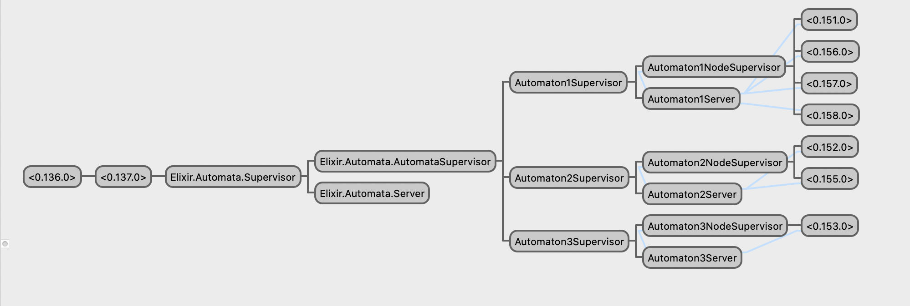

#  ⦿	| Automata | ⦿	⦿ 	⦿	⦿	⦿ ⦿   ⦿	⦿

### An AI control architecture framework for building autonomous decentralized systems ([ADS](https://en.wikipedia.org/wiki/Autonomous_decentralized_system)).


Spawn a set of concurrent, distributed, fault tolerant, and highly available intelligent agents for coordinated and/or uncoordinated action in one or many environments with no central point of failure. This project is Open Source.

##### This project is in the Alpha stage and not ready for production systems. We need Contributors to get to 1.0! Please join the [slack channel](https://join.slack.com/t/automata-org/shared_invite/enQtOTI5OTUyNTM5MDA5LTliZTM2NmI3OWI1YmM1ZjZjYzQ5OTFmM2JiNDFiMTE5OWJkYTIzZGI5YTVkZDM1YzdjMDQ3NDI2NGQ0ZmQ1Y2I) and/or reach out to [ericsteen1@gmail.com](mailto:ericsteen1@gmail.com) if interested!

## Implementation Overview

### Technology
 [Elixir](https://elixir-lang.org/) & [OTP](https://en.wikipedia.org/wiki/Open_Telecom_Platform) provide the primitives for robust concurrent, fault-tolerant, highly available, self-healing distributed systems.

 [Behavior trees](https://en.wikipedia.org/wiki/Behavior_tree_(artificial_intelligence,_robotics_and_control)) are increasingly used in place of finite state machines (FSM's) and other AI control architectures due to improved properties of modularity, flexibility, reusability, and efficiency of implementation. To keep modules lean and keep the trees focused on actions, one potential approach is to utilize an external decision making system (finite state machine, decision tree, utility, stochastic, etc..) for all decision making, keeping nodes focused on actions.


### Requirements

#### A system is defined as an Autonomous decentralized system if the following 2 properties are satisfied:

 1. Autonomous Controllability: Even if any subsystem fails, is repaired, and/or is newly added, the other subsystems can continue to manage themselves and function.

 2. Autonomous Coordinability: Even if any subsystem fails, is repaired, and/or is newly added, the other subsystems can coordinate their individual objectives among themselves and can function in a coordinated fashion.

    - With `Automata`, while it is a property of the behavior tree implementation that user-defined nodes are independent, it is left to the designer to ensure coordination independence among all nodes in order to satisfy this property.

## Features

### Functional Features:
- #### User defined behavior trees
  - Control Nodes currently on the roadmap
    - Selector
    - Sequence
    - Parallel
    - Priority
  - Condition nodes
  - In-node Decorators
  - Helper Nodes for accessing knowledge/messaging systems

- #### A Concurrent, Scalable Blackboard Knowledge System
  - A global blackboard that can broadcast messages without being a central point of failure.
  - Individual Node blackboards readable by all nodes, writeable by owning node
  - ETS Implementation?
  - Potentially bringing the code to the data rather than the other way around.


### Performance Features:
- Concurrency
  - News flash! The world is concurrent. For example: we see, hear, and move at the same time. Elixir concurrency is a first class citizen of it's design and makes it dead simple.
- High availability
  - Elixir is renowned for being capable of 99.9999999% uptime with relatively little effort.
- Fault Tolerance
  - OTP Supervision Trees provide strong guarantees for error recovery and self healing systems.
- Scalability
  -  Elixir can handle millions of processes (134 million +/-) utilizing all cores without breaking a sweat on a single machine, and easily distributes work onto multiple machines with its builtin distribution mechanisms and CRDT with libraries like [Horde](https://github.com/derekkraan/horde).
  - Behavior trees provide value stream scalability (design/development and operations/testing).
- Modularity
  - Modular BT's allow the designer to hierarchically combine independently developed, tested, deployed, and reusable unit behaviors that provide more complex and interesting (and valuable) emergent properties in the large.
- Flexibility
  - A design goal of `Automata` is to allow high flexibility (supports many use cases)
- Simplicity of Implementation
  - Elixir's meta-programming capabilities facilitate very user-friendly API's so developers don't need to know the details of BT's or Automata Theory to get things done.

### Applications
- Trading Systems
- Swarm Intelligence / Distributed Robotics
- Intelligent agents with soft realtime multi-dimensional sensory, perception and intuition capabilities
- Multi-Agent Reinforcement Learning
- Mixture of Experts Deep Learning (python inter-op with [erlport](http://erlport.org/))
- Blockchain Smart Contract Systems
- Analytics Systems
- Smart Home / IOT Systems
- High-Speed Rail Systems (Japan has an ADS railway that learns)
- Chatbots & Game AI's
- QA Testing (BT's are particularly suited to combinatorial testing)
- ? (choose your adventure)


## Contributing

### Welcome to the Automata project!

##### We are eager for your contributions and very happy you found yourself here! Here are our current needs:

- Elixir Design, Architecture & Coding Best Practices Expertise
- AI, Cognitive Architecture & Behavior Tree Expertise
- ETS, BlackBoard System Expertise
- Test Coverage
- Documentation
- Senior Code Reviewers to ensure Quality
- Willingness and motivation to learn it all

A good place to start is in the [issues tracker](https://github.com/upstarter/automata/issues). Especially those labeled 'good first issue'.

Please join the [slack channel](https://join.slack.com/t/automata-org/shared_invite/enQtOTI5OTUyNTM5MDA5LTliZTM2NmI3OWI1YmM1ZjZjYzQ5OTFmM2JiNDFiMTE5OWJkYTIzZGI5YTVkZDM1YzdjMDQ3NDI2NGQ0ZmQ1Y2I) and/or reach out to [ericsteen1@gmail.com](mailto:ericsteen1@gmail.com) if interested!

### Current Status
The project is currently in the Research & Prototype Development phase. We are establishing the core concepts, requirements, practices, and standards for the healthy and fruitful governance of the project.  Join the conversation on [The Automata Project Slack Channel](https://join.slack.com/t/automata-org/shared_invite).

Currently `Automata` is being developed as a single-node (machine) and single automaton system, but the architecture is in place to achieve the goal of a multi-node (full fault tolerance) and multi-automaton (hence the name, automata) distributed system in the not-too-distant future.

### Engineering Standards & Best Practices
Check the #dev or #testing channels on [slack]((https://join.slack.com/t/automata-org/shared_invite)) for questions/info.
#### Design Standards
1. Abstraction & Modularity are key. If its more than a 5-10 lines, put it in a unit Function, Module or Struct that is tested and named well (by its role in the context if possible, rather than its data type or random name).
2. Meta-programming will be heavily used as this is a framework, but it is important to know where it is useful and where its not. It is wise not to overuse clever meta-programming magic (a common complaint about rails). If your not sure, ask. Or use the force Luke (if your a Jedi).
3. If your not sure how to do something, rather than do a hack, put a skeleton in place and submit a PR so a more senior engineer can provide guidance.

#### Coding & PR Review Standards
1. No shortcuts or Rush Jobs. Quality is job #1. We are creating something of very high quality, built to stand the test of time. If you don't know the best way to do something, ask a core team member, or reach out to the very helpful Elixir community. See the [list of resources](#help).
2. Code Reviews by core team members are required before merging and must be escalated if there is even the slightest concern of a design/logic flaw or incomplete testing. Imagine your building a rocket to mars and putting you and your family on it. Would you commmit that spaghetti code now?
4. Every PR should have test coverage unless it is a trivial change or is approved by 2 core team members or designated reviewers.
5. The Benevelant Dictator For Live ([BDFL](https://en.wikipedia.org/wiki/Benevolent_dictator_for_life)) — [upstarter](https://github.com/upstarter), is a major [stickler](https://dictionary.cambridge.org/us/dictionary/english/stickler) when it comes to architecture, design & code quality. Be warned. 😉


#### Testing Standards
In Progress. Property Testing? Permutation Testing? Join the conversation on [The Automata Project Slack Channel](https://join.slack.com/t/automata-org/shared_invite)

##### <a name="help"></a>Where to ask for help:

1. [The Automata Project Slack Channel](https://join.slack.com/t/automata-org/shared_invite/enQtOTI5OTUyNTM5MDA5LTliZTM2NmI3OWI1YmM1ZjZjYzQ5OTFmM2JiNDFiMTE5OWJkYTIzZGI5YTVkZDM1YzdjMDQ3NDI2NGQ0ZmQ1Y2I)
2. [Elixir Forum](https://elixirforum.com/)
3. [Elixir Slack Channel](https://elixir-slackin.herokuapp.com/)
4. [Stack Overflow](https://stackoverflow.com/questions/tagged/elixir)
5. [Reddit](https://www.reddit.com/r/elixir/)
6. [Quora](https://www.quora.com)
7. [Discord](https://www.discordapp.com)


### How it works

#### High Level Overview

##### The Automata supervision tree


There are 3 Layers in the "core" supervision tree below the Application supervisor. The terminal nodes of the "core" are the `AutomatonNodeSupervisor` which supervises the user-defined behavior tree nodes with the help of its "brain" – the `AutomatonServer`. The `AutomatonServer` currently handles the bulk of the logic of the system, as it is responsible for parsing user-config, and starting and managing the user-defined nodes. It starts the user defined nodes as children of `AutomatonNodeSupervisor`, which is kept lean for fault tolerance purposes.

The following is a breakdown of roles and responsibilities in the system (corresponding to files in `lib/automata/core/`):

- `Automata.Supervisor`
  - on application start, this supervisor process starts the `AutomataSupervisor` and it's corresponding `Server`. It is started with strategy `:one_for_one` to ensure that the `AutomatonSupervisor` is independently self-healing
- `Automata.Server`
  - acts as the "brains" of the `AutomataSupervisor` to keep the supervisor lean and mean. It starts the `Automata.AutomatonSupervisor`, passing the user-defined config.
- `Automata.AutomatonSupervisor`
  - this process acts as supervisor to each `AutomatonNodeSupervisor` and has strategy `:one_for_all` to ensure that errors restart the entire supervision tree including the GenServers (`AutomatonServer`). It delegates the spawning of the user-defined BT nodes to the `AutomatonServer` which currently handles most of the logic.
- `AutomatonNodeSupervisor`
  - runs concurrently, independently, and with `restart: permanent`. This supervisor is the root of the user-defined behavior trees.
- `AutomatonServer`
  - this is the most complicated node as it parses and validates the user configuration and creates and manages the user-defined behavior tree nodes.
- `Automaton`
    - the user defined node (runs as placeholder, with it's replacement being developed in `core/control/behavior.ex`)


##### The Blackboard

- Global Blackboard
  - all nodes share this knowledge store
  - the automata will act upon seeing any data change in the global blackboard
- Individual Node Blackboards
  - node blackboards use protected tables for knowledge sharing – all processes can read, one process has write access


### API
```elixir
defmodule MyNode do
  use Automaton.Behavior,

    # required
    # one of :sequence, :selector, :parallel, etc...
    # or type :execution for execution nodes (no children)
    node_type: :selector,

    # the frequency of updates for this node(tree), in seconds
    tick_freq: 0.001, # 1ms

    # not included for execution nodes
    # list of child control/execution nodes
    # these run in order for type :selector and :sequence nodes
    # and in parallel for type :parallel
    children: [ChildNode1, ChildNode2, ChildNode3]


    # overrides update function defined in use macro
    # called every tick, returns current status
    def update do
      # do stuff
      {:ok, status}
    end
end
```

### Example

Below is a simplified hypothetical example of a sequence node(subtree) for an autonomous "Forex Trader". The first two leafs are condition nodes, and the last two are action nodes.


TODO: how to implement the above scenario.

#### Where to read about the technologies underlying `Automata`:

###### The core architecture
- [The Elixir and OTP Guidebook](https://www.manning.com/books/the-little-elixir-and-otp-guidebook). old but very good

- [Elixir in Action, Second Edition](https://www.manning.com/books/elixir-in-action-second-edition). new and very good

###### Libraries & Tooling (Still in Discussion)
- [libcluster](https://github.com/bitwalker/libcluster)
- [swarm](https://github.com/bitwalker/swarm)
- [Horde](https://github.com/derekkraan/horde)


###### Behavior Trees
- [CraftAI BT Grammar Basics](https://www.craft.ai/blog/bt-101-behavior-trees-grammar-basics/)

- [Behavior Tree Starter Kit](http://www.gameaipro.com/GameAIPro/GameAIPro_Chapter06_The_Behavior_Tree_Starter_Kit.pdf) and corresponding [provided source code](https://github.com/aigamedev/btsk) and in particular [this file](https://github.com/aigamedev/btsk/blob/master/BehaviorTree.cpp) which is a basic inspiration for user-defined nodes.

- [Elixir Behavior Tree](https://github.com/jschomay/elixir-behavior-tree) and the corresponding [elixirconf talk](https://elixirforum.com/t/39-elixirconf-us-2018-behavior-trees-and-battleship-tapping-into-the-power-of-advanced-data-structures-jeff-schomay/16785)

- [BT AI](https://github.com/libgdx/gdx-ai/wiki/Behavior-Trees)

###### The Blackboard
- [BlackBoard Architectures](https://books.google.com/books?id=1OJ8EhvuPXAC&pg=PA459&lpg=PA459&dq=blackboard+game+ai&source=bl&ots=iVYGrf_Rzy&sig=ACfU3U31OOqst7Dd7z7fhiH9HoVwBjyVJQ&hl=en&sa=X&ved=2ahUKEwjvxqyR3LHnAhVMrp4KHSSfD4sQ6AEwDHoECAsQAQ#v=onepage&q=blackboard%20game%20ai&f=false)

- [Blackboard Systems](http://gbbopen.org/papers/ai-expert.pdf)


## Installation

If [available in Hex](https://hex.pm/docs/publish), the package can be installed
by adding `Automata` to your list of dependencies in `mix.exs`:

```elixir
def deps do
  [
    {:automata, "~> 0.1.0"}
  ]
end
```

## Authors

* **Eric Steen** - [upstarter](https://github.com/upstarter)

See also the list of [contributors](https://github.com/upstarter/automata/contributors) who participated in this project.

## License

This project is licensed under the Apache 2.0 License - see the [License.md](./License.md) file for details or [](https://opensource.org/licenses/Apache-2.0)
